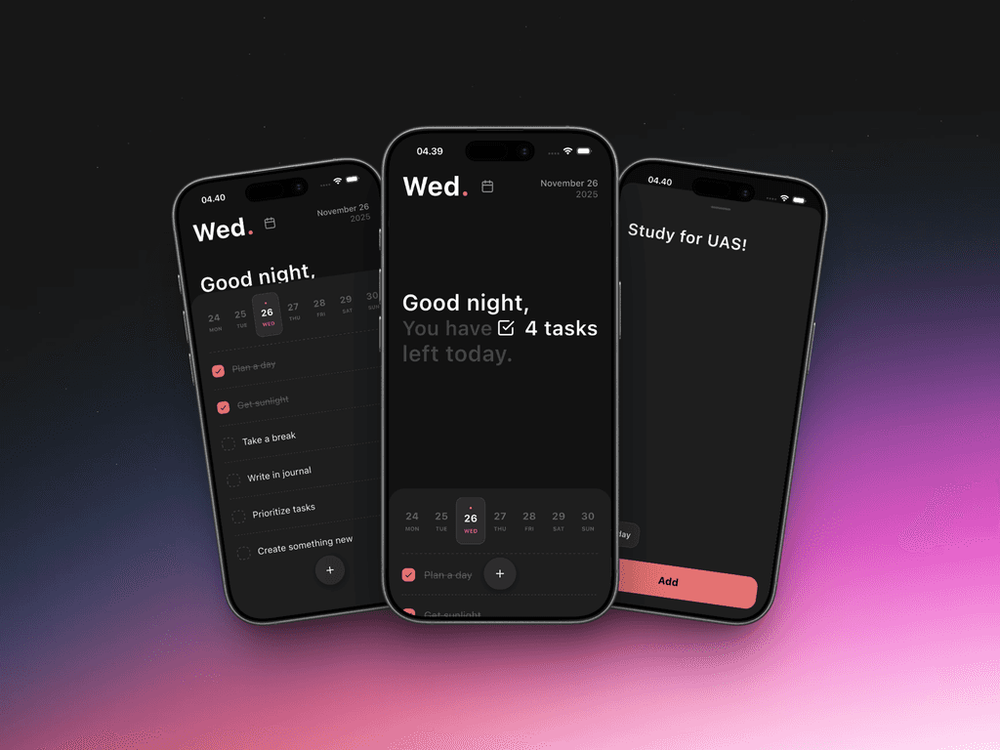

# ToDoList

**A task app with attention to the way it moves.**

A Flutter mobile project exploring task-list interaction, animation, and local persistence.

[Design case study](https://feboyfierlyan.com/projects/todolist) · [More projects](https://github.com/feboyfierlyan)



Preview from the [published portfolio](https://feboyfierlyan.com/projects/todolist).

## Inside the project

The application lives in [`lib/main.dart`](lib/main.dart). It uses Flutter's widgets and custom painting, `flutter_animate` for motion, `shared_preferences` for local storage, and modal bottom sheets for interaction.

## Run locally

Use a Flutter SDK that includes Dart 3.9.2 or a compatible later 3.x release, as required by [`pubspec.yaml`](pubspec.yaml), and connect a device or start an emulator.

```sh
git clone https://github.com/feboyfierlyan/ToDoList.git
cd ToDoList
flutter pub get
flutter run
```

For iOS development, install Xcode and CocoaPods. If native dependencies need refreshing:

```sh
cd ios
pod install
cd ..
```

## Design story

The [case study](https://feboyfierlyan.com/projects/todolist) presents the interface and motion direction. This repository contains the Flutter implementation.
